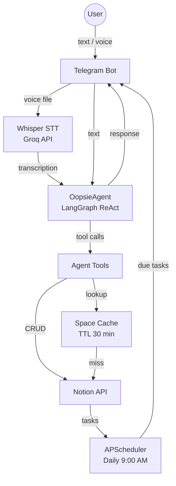
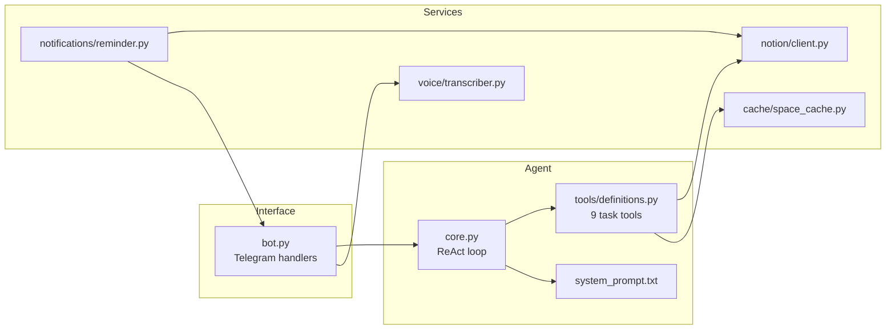

# Oopsie

Asistente personal de gestión de tareas con IA que funciona a través de Telegram y almacena las tareas en Notion. Entiende lenguaje natural en español, procesa mensajes de voz y envía recordatorios diarios de tareas próximas.

## Funcionalidades

- Gestión de tareas en múltiples espacios de trabajo de Notion ("spaces")
- Interpretación de fechas en lenguaje natural (*"mañana"*, *"el viernes"*, etc.)
- Transcripción de mensajes de voz
- Recordatorios diarios de tareas con vencimiento en los próximos 2 días
- Teclado inline para selección de espacio
- Memoria de conversación por sesión de usuario

---

## Arquitectura



### Visión general de componentes



---

## Modelos

| Rol | Modelo | Proveedor |
|-----|--------|-----------|
| LLM (razonamiento del agente) | `qwen/qwen3-coder-30b-a3b-instruct` | [OpenRouter](https://openrouter.ai) |
| Voz a texto | `whisper-large-v3` | [Groq](https://groq.com) |

La observabilidad del LLM se gestiona con [Langfuse](https://langfuse.com).

---

## Stack tecnológico

- **Python 3.11**
- **LangGraph** — patrón de agente ReAct
- **LangChain** — abstracción del LLM
- **python-telegram-bot** — interfaz de Telegram
- **notion-client** — API de Notion
- **APScheduler** — tarea de recordatorios diarios
- **cachetools** — caché TTL de espacios
- **dateparser** — fechas en lenguaje natural en español
- **Docker / Docker Compose**

---

## Variables de entorno

```env
TELEGRAM_BOT_TOKEN=
TELEGRAM_USER_ID=

OPENROUTER_API_KEY=
GROQ_API_KEY=

NOTION_API_KEY=
NOTION_ROOT_PAGE_ID=

# Opcional — observabilidad con Langfuse
LANGFUSE_SECRET_KEY=
LANGFUSE_PUBLIC_KEY=
LANGFUSE_HOST=
```

---

## Inicio rápido

```bash
# 1. Copia y rellena las variables de entorno
cp .env.example .env

# 2. Lanza con Docker Compose
docker compose up --build
```
