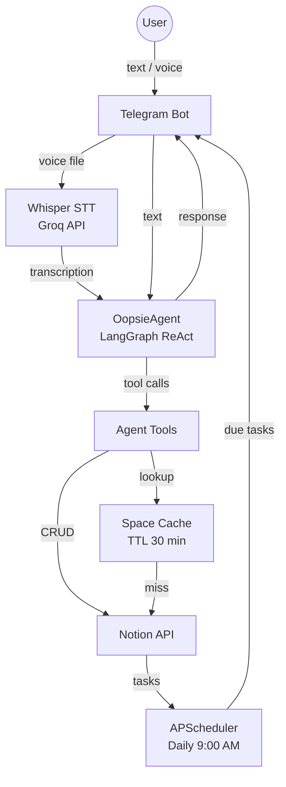
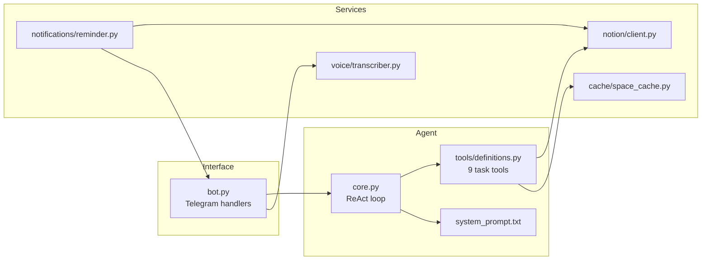

# Oopsie

A personal AI task management assistant that runs on Telegram and stores tasks in Notion. Understands Spanish natural language, handles voice messages, and sends daily reminders for upcoming tasks.

## Features

- Manage tasks across multiple Notion workspaces ("spaces")
- Natural language date parsing in Spanish (*"mañana"*, *"el viernes"*, etc.)
- Voice message transcription
- Daily reminders for tasks due in the next 2 days
- Inline keyboard for space selection
- Conversation memory per user session

---

## Architecture



### Component Overview



---

## Models

| Role | Model | Provider |
|------|-------|----------|
| LLM (agent reasoning) | `qwen/qwen3-coder-30b-a3b-instruct` | [OpenRouter](https://openrouter.ai) |
| Speech-to-Text | `whisper-large-v3` | [Groq](https://groq.com) |

LLM observability is handled by [Langfuse](https://langfuse.com).

---

## Tech Stack

- **Python 3.11**
- **LangGraph** — ReAct agent pattern
- **LangChain** — LLM abstraction
- **python-telegram-bot** — Telegram interface
- **notion-client** — Notion API
- **APScheduler** — daily reminder job
- **cachetools** — TTL space cache
- **dateparser** — Spanish natural language dates
- **Docker / Docker Compose**

---

## Environment Variables

```env
TELEGRAM_BOT_TOKEN=
TELEGRAM_USER_ID=

OPENROUTER_API_KEY=
GROQ_API_KEY=

NOTION_API_KEY=
NOTION_ROOT_PAGE_ID=

# Optional — Langfuse observability
LANGFUSE_SECRET_KEY=
LANGFUSE_PUBLIC_KEY=
LANGFUSE_HOST=
```

---

## Quick Start

```bash
# 1. Copy and fill in your environment variables
cp .env.example .env

# 2. Run with Docker Compose
docker compose up --build
```
