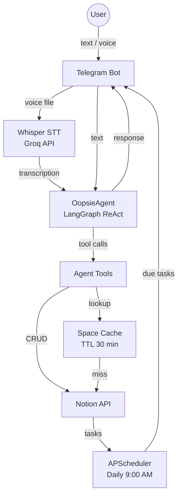
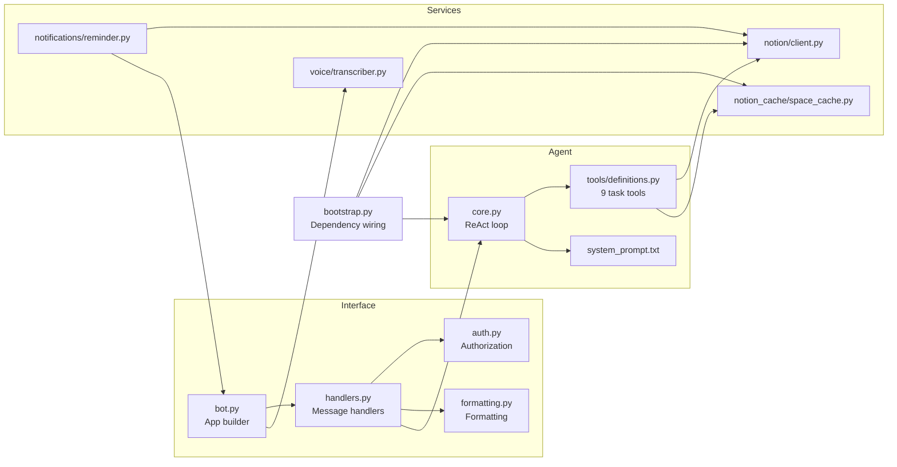

<div align="center">

  

  <h1>Oopsie</h1>
  <h3>Asistente personal de gestión de tareas con IA</h3>
  
  <p>Entiende lenguaje natural en español, procesa mensajes de voz por Telegram y organiza tu vida en Notion mediante un agente ReAct.</p>

  <p>
    
    
    
    
    
    
  </p>

</div>

---

## Funcionalidades

- Gestión de tareas en múltiples espacios de trabajo de Notion ("spaces")
- Interpretación de fechas en lenguaje natural (*"mañana"*, *"el viernes"*, etc.)
- Transcripción de mensajes de voz
- Recordatorios diarios de tareas con vencimiento en los próximos 2 días
- Teclado inline para selección de espacio
- Memoria de conversación por sesión de usuario

---

## Arquitectura


```mermaid
graph TD
    User((User)) -->|text / voice| TG[Telegram Bot]
    TG -->|voice file| STT[Whisper STT\nGroq API]
    STT -->|transcription| Agent
    TG -->|text| Agent[OopsieAgent\nLangGraph ReAct]
    Agent -->|tool calls| Tools[Agent Tools]
    Tools -->|CRUD| Notion[Notion API]
    Tools -->|lookup| Cache[Space Cache\nTTL 30 min]
    Cache -->|miss| Notion
    Agent -->|response| TG
    Scheduler[APScheduler\nDaily 9:00 AM] -->|due tasks| TG
    Notion -->|tasks| Scheduler
```

### Visión general de componentes


```mermaid
flowchart LR
    subgraph Interface
        BOT[bot.py\nApp builder]
        HANDLERS[handlers.py\nMessage handlers]
        AUTH[auth.py\nAuthorization]
        FORMAT[formatting.py\nFormatting]
    end

    subgraph Agent
        CORE[core.py\nReAct loop]
        TOOLS[tools/definitions.py\n9 task tools]
        PROMPT[system_prompt.txt]
    end

    subgraph Services
        NOTION[notion/client.py]
        VOICE[voice/transcriber.py]
        CACHE[notion_cache/space_cache.py]
        REMINDER[notifications/reminder.py]
    end

    BOOTSTRAP[bootstrap.py\nDependency wiring]

    BOT --> HANDLERS
    HANDLERS --> AUTH
    HANDLERS --> FORMAT
    HANDLERS --> CORE
    BOOTSTRAP --> CORE
    BOOTSTRAP --> NOTION
    BOOTSTRAP --> CACHE
    CORE --> TOOLS
    CORE --> PROMPT
    TOOLS --> NOTION
    TOOLS --> CACHE
    BOT --> VOICE
    REMINDER --> NOTION
    REMINDER --> BOT
```

---

## Modelos

| Rol | Modelo | Proveedor |
|-----|--------|-----------|
| LLM (razonamiento del agente) | `qwen/qwen3-coder-30b-a3b-instruct` | [OpenRouter](https://openrouter.ai) |
| Voz a texto | `whisper-large-v3` | [Groq](https://groq.com) |

La observabilidad del LLM se gestiona con [Langfuse](https://langfuse.com).

---

## Stack tecnológico

- **Python 3.11**
- **LangGraph** — patrón de agente ReAct
- **LangChain** — abstracción del LLM
- **python-telegram-bot** — interfaz de Telegram
- **notion-client** — API de Notion
- **APScheduler** — tarea de recordatorios diarios
- **cachetools** — caché TTL de espacios
- **dateparser** — fechas en lenguaje natural en español
- **pytz** — manejo de zonas horarias
- **Docker / Docker Compose**

---

## Configuración

El proyecto usa dos fuentes de configuración:

### Variables de entorno (`.env`)

Contienen los secretos y credenciales:

```env
TELEGRAM_BOT_TOKEN=
TELEGRAM_USER_ID=

OPENROUTER_API_KEY=

GROQ_API_KEY=

NOTION_API_KEY=
NOTION_ROOT_PAGE_ID=

# Opcional — observabilidad con Langfuse
LANGFUSE_SECRET_KEY=
LANGFUSE_PUBLIC_KEY=
LANGFUSE_HOST=
```

### Configuración YAML (`config/config.yaml`)

Contiene los parámetros del modelo LLM, voz y zona horaria. Se carga desde `config/config.yaml`; si no existe, se usa `config/config.example.yaml` como fallback.

```yaml
llm:
  model: "qwen/qwen3-coder-30b-a3b-instruct"
  base_url: "https://openrouter.ai/api/v1"
  temperature: 0.7
  max_tokens: 4096
  model_kwargs:
    top_p: 0.8
    top_k: 20
    repetition_penalty: 1.05
    enable_thinking: false

voice:
  model: "whisper-large-v3"
  base_url: "https://api.groq.com/openai/v1"
  language: "es"

timezone: "Europe/Madrid"
```

---

## Inicio rápido

```bash
# 1. Copia y rellena las variables de entorno
cp .env.example .env

# 2. Copia y ajusta la configuración YAML (opcional)
cp config/config.example.yaml config/config.yaml

# 3. Lanza con Docker Compose
docker compose up --build
```
